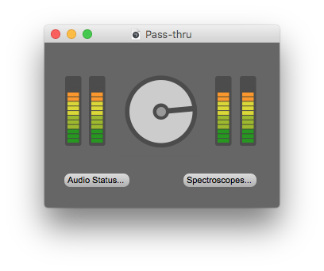
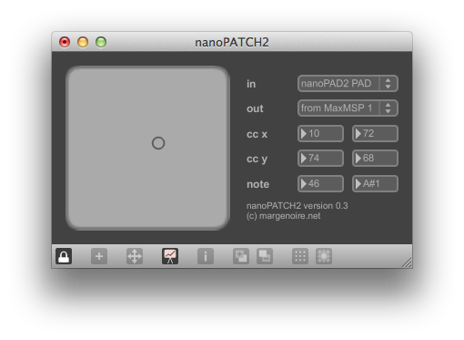

## Pass-thru

Audio input/output pass-thru MaxMSP patch.

Route any audio input to any audio output, featuring gain and L/R spectroscope.

Use _Audio Status..._ button to setup audio devices, channels, sample rate and buffer size (clipping distortion).

## nanoPATCH2

nanoPAD2 sliders MaxMSP patch.

Alter control change messages while pressing trigger pads. Up to 128 controllers.

Touch X-Y pad while pressing a trigger pad to send control change messages.

Control change number is calculated as follow:

	X-axis: Trigger pad MIDI note pitch value - 36 (from number 0 to number 63)
	Y-axis: Trigger pad MIDI note pitch value - 36 and + 64 (from number 64 to number 127)

Control change value is X or Y value. Pass-through all others MIDI messages.

## nanoFIGHTER2D

nanoPAD2 "Midi Fighter 3D style" MaxMSP patch.

Alter control change messages while pressing trigger pads. Up to 256 controllers.
Adaptation of nanoPATCH2 to behave like a Midi Fighter 3D.

Touch X-Y pad while pressing a trigger pad to send control change messages.

__Absolute mode__

	X-axis: trigger pad MIDI note pitch value - 36 (from number 0 to number 63, channel 3)
	Y-axis: trigger pad MIDI note pitch value - 36 and + 64 (from number 64 to number 127, channel 3)

__Relative mode__

	X-axis < 64: trigger pad MIDI note pitch value - 36 (from number 0 to number 63, channel 4)
	X-axis >= 64: trigger pad MIDI note pitch value - 36 (from number 0 to number 63, channel 5)
	Y-axis < 64: trigger pad MIDI note pitch value - 36 and + 64 (from number 64 to number 127, channel 4)
	Y-axis >= 64: trigger pad MIDI note pitch value - 36 and + 64 (from number 64 to number 127, channel 5)

